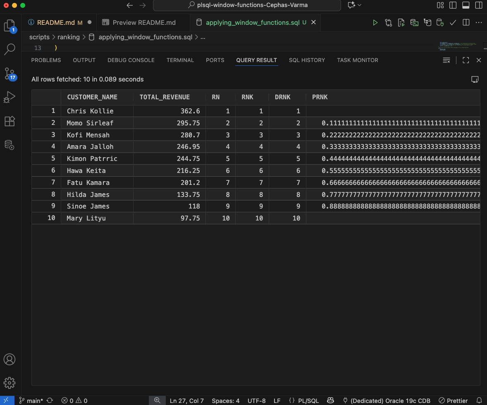
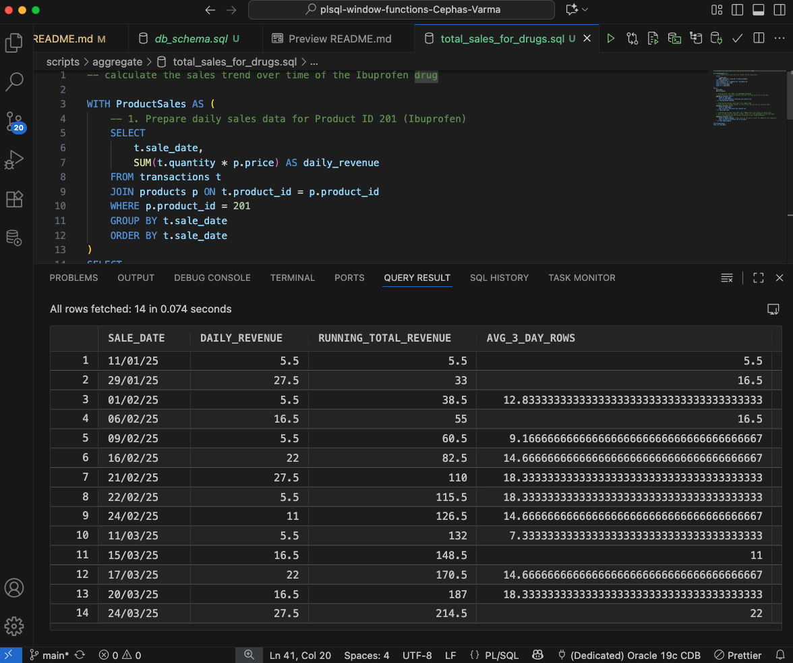
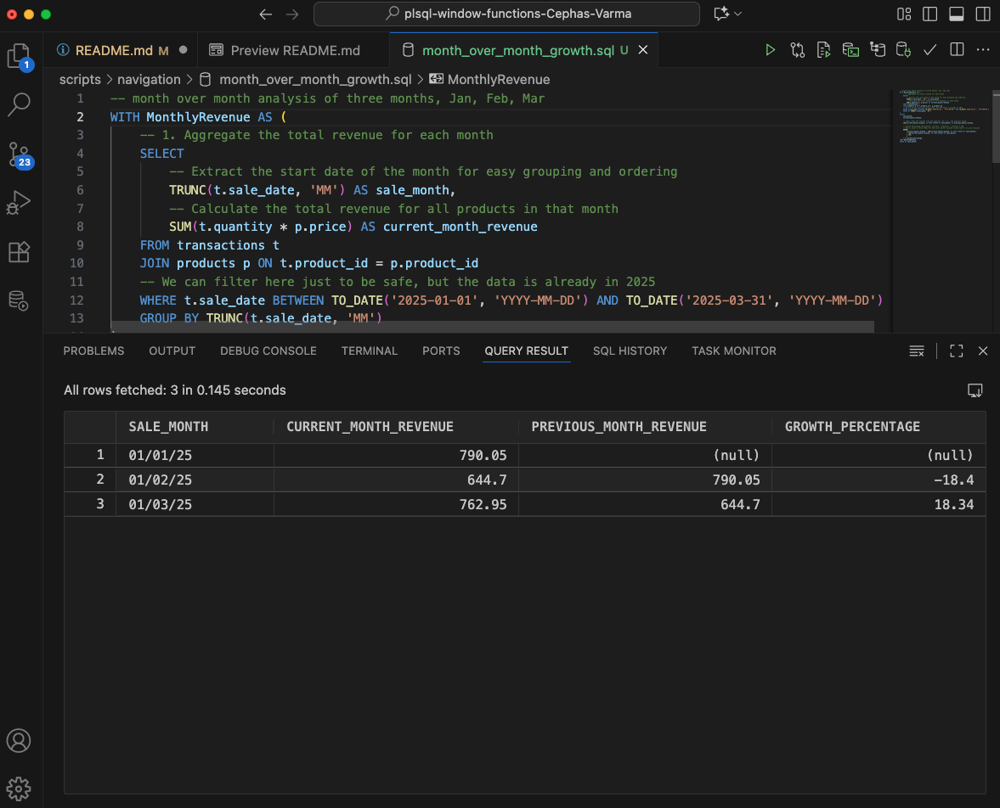
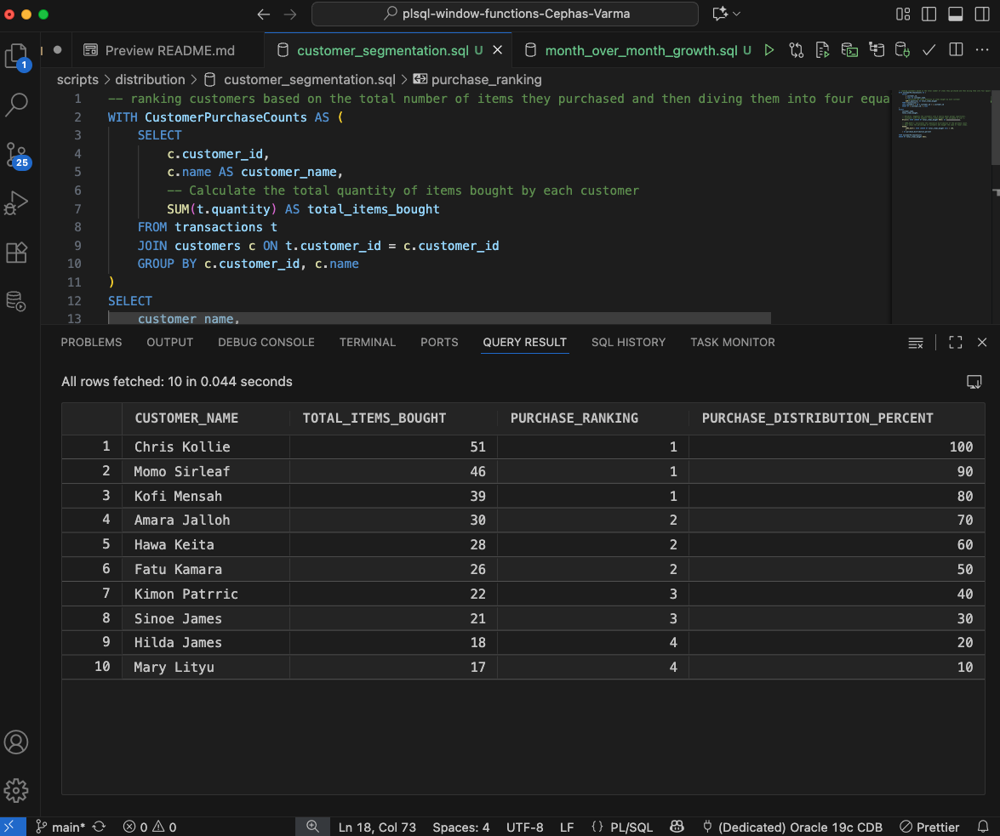

# plsql-window-functions-Cephas-Varma
plsql-window-functions assignment

## Problem Definition 
Define a specific, measurable business scenario.

#### Business Context (company type, department, industry)
A pharmaceutical company that run pharmacies across five different locations in the Monrovia, Liberia.

#### Data Challenge (2–3 sentences explaining the problem)
The company needs to analyze sales data from the first three months in the year (2025) to identify the best-selling drugs and understand customer purchasing behavior. The main challenge is to determine the single top-selling drug across all locations and identify which customers bought it, how frequently they bought it, and then to segment these customers based on their purchase frequency.

#### Expected Outcome (decision/insight from analysis)
The analysis is going to going to provide actionable insight that allows the company to prioritize the inventory of the most-sold drug to ensure it's always in stock. Additionally, the customer segmentation will help the marketing department create targeted campaigns to reward frequent buyers and encourage less frequent buyers. This will help the company optimize supply chains and increase customer retention.

High scoring: “Identify top products per region, analyze customer frequency, and segment customers for marketing.” Low scoring: “Analyze sales data to find patterns.”


## Success Criteria
Define exactly 5 measurable goals:

1. Customers ranked by to revenue spent→ RANK() 
    - **Identify the top purchasing customer in the first three month of the year (2025)** -  This will be accomplished by joining the transactions and products tables to calculate total revenue per customer.
2. Running monthly sales totals → SUM() OVER() 
    - **Calculate the running total of sales for the top-selling drug on a daily basis** - This will be achieved using a SUM() window function with an OVER() clause. The goal is to see a cumulative sales figure for the first three months.
3. Month-over-month growth → LAG()/LEAD() 
    - **Determine the week-by-week growth of the top-selling drug's sales** - This will be done by using the LAG() or LEAD() functions to compare sales data between the first three months. The success criteria is the calculation of a growth percentage, whether positive or negative, for each month.
4. Customer quartiles → NTILE(4) 
    - **Group customers into quartiles based on their total spending over three mongths** - This will be accomplished using the NTILE(4) window function, which divides the ordered set of customers into four equally sized groups (quartiles). The success criteria is the classification of each customer into a numbered quartile, with "1" being the top 25% of spenders.
5. 3-month moving averages → AVG() OVER()
    - **Calculate a moving average of the top-selling drug's sales over a 3-month period.** - This will be implemented using the AVG() window function with a ROWS or RANGE frame. The success criteria is the generation of a smoothed sales trend line that helps to identify broader fluctuations and the average monthly sales over the first quarter.


## Database Schema

| Table | Purpose | Key Columns | Example Row |
| :--- | :--- | :--- | :--- |
| **pharmacies** | Stores information about each pharmacy location. | `pharmacy_id` (PK), `name`, `county` | `5001`, `Yekepah Pharmacy`, `Montserrado` |
| **customers** | Stores customer info, linked to a specific pharmacy where they primarily shop (FK defined on creation). | `customer_id` (PK), `name`, `pharmacy_id` (FK) | `1001`, `Jane Smith`, `5001` |
| **products** | Contains the pharmaceutical product catalog. | `product_id` (PK), `name`, `price` | `2001`, `Paracetamol`, `15.50` |
| **transactions** | Records sales, linking customers, products, and the specific pharmacy where the sale occurred. | `transaction_id` (PK), `customer_id` (FK), `product_id` (FK), `pharmacy_id` (FK), `quantity`, `sale_date` | `3001`, `1001`, `2001`, `5001`, `2`, `2025-01-15` |


## ER Diagram



Explanation of Relationships

- PHARMACIES has many CUSTOMERS and many TRANSACTIONS: A single pharmacy location can be the primary shop for multiple customers and is the site where multiple transactions occur.

- CUSTOMERS makes many TRANSACTIONS: Over time, a single customer can be recorded in multiple transaction records.

- PRODUCTS is in many TRANSACTIONS: A single product (drug) can be sold many times across various transaction records.

## Window Functions Implementation (4 pts)
Implement all 4 categories

#### Ranking: ROW_NUMBER(), RANK(), DENSE_RANK(), PERCENT_RANK() Use case: Top N customers by revenue 
##### Query
```sql
-- Calculating the total money spent by each customer.
WITH CustomerRevenue AS (
    SELECT
        c.customer_id,
        c.name AS customer_name,
        -- Calculate the total revenue (quantity * price) for all their transactions
        SUM(t.quantity * p.price) AS total_revenue
    FROM transactions t
    JOIN products p ON t.product_id = p.product_id -- Link transactions to product prices
    JOIN customers c ON t.customer_id = c.customer_id -- Link transactions to customer names
    -- Group the results so we get one total revenue value for each unique customer
    GROUP BY c.customer_id, c.name
)
-- Now select the calculated revenue and apply all four ranking functions.
SELECT
    customer_name,
    total_revenue,
    -- ROW_NUMBER: Gives a unique number to every customer, starting at 1. 
    -- If two customers have the same revenue (a tie), they get different, sequential numbers.
    ROW_NUMBER() OVER (ORDER BY total_revenue DESC) AS rn,

    -- RANK: Gives the same number to tied customers. 
    -- It then skips the next number. (Example: 1, 2, 2, 4)
    RANK() OVER (ORDER BY total_revenue DESC) AS rnk,

    -- DENSE_RANK: Gives the same number to tied customers. 
    -- It does NOT skip the next number. (Example: 1, 2, 2, 3) This is often used for "Top N" lists.
    DENSE_RANK() OVER (ORDER BY total_revenue DESC) AS drnk,

    -- PERCENT_RANK: Shows a customer's rank as a percentile (from 0 to 1). 
    -- This tells you how well they scored relative to everyone else.
    PERCENT_RANK() OVER (ORDER BY total_revenue DESC) AS prnk
FROM CustomerRevenue
-- Show the customer with the highest revenue first
ORDER BY total_revenue DESC;
```
##### Screenshot


##### Interpretation 
This script successfully calculates each customer's **total revenue** and ranks them using four key window functions. **`DENSE_RANK()`** is typically the most practical for a "Top N" business report as it handles revenue ties gracefully without skipping rank numbers. **`ROW_NUMBER()`** assigns a unique position to every customer, while **`RANK()`** skips positions after a tie, and **`PERCENT_RANK()`** shows relative standing as a percentage.


#### Aggregate: SUM(), AVG(), MIN(), MAX() with frame comparisons (ROWS vs RANGE) Use case: Running totals & trends 
##### Query
```sql
-- calculate the sales trend over time of the Ibuprofen drug

WITH ProductSales AS (
    -- 1. Prepare daily sales data for Product ID 201 (Ibuprofen)
    SELECT
        t.sale_date,
        SUM(t.quantity * p.price) AS daily_revenue
    FROM transactions t
    JOIN products p ON t.product_id = p.product_id
    WHERE p.product_id = 201
    GROUP BY t.sale_date
    ORDER BY t.sale_date
)
SELECT
    sale_date,
    daily_revenue,

    -- Running Total: Uses SUM() and UNBOUNDED PRECEDING
    -- Calculates the cumulative revenue from the first day up to the current day.
    SUM(daily_revenue) OVER (
        ORDER BY sale_date
        ROWS BETWEEN UNBOUNDED PRECEDING AND CURRENT ROW
    ) AS running_total_revenue,

    -- 3-Day Moving Average: Uses AVG() and a ROWS frame
    -- Calculates the average revenue for the current day and the two previous days.
    AVG(daily_revenue) OVER (
        ORDER BY sale_date
        ROWS BETWEEN 2 PRECEDING AND CURRENT ROW
    ) AS avg_3_day_rows,

    -- 3-Day Moving Average: Uses AVG() and a RANGE frame (Less common for dates/time)
    -- This is often used for numeric columns. Since it's less meaningful on non-time data, 
    -- we'll just demonstrate the syntax, assuming a 3-unit range difference.
    AVG(daily_revenue) OVER (
        ORDER BY daily_revenue -- Must order by the metric itself for RANGE to work logically
        RANGE BETWEEN 5 PRECEDING AND 5 FOLLOWING
    ) AS avg_range_example

FROM ProductSales
ORDER BY sale_date;
```
##### Screenshot


##### Interpretation 
This query calculates two crucial metrics for a product's sales trend: a running total of revenue and a 3-day moving average. The running total shows the cumulative growth in sales over time, while the moving average smooths out daily fluctuations to reveal the underlying sales trend.

#### Navigation: LAG(), LEAD(), growth % calculations Use case: Period-to-period analysis 
##### Query
```sql
-- month over month analysis of three months, Jan, Feb, Mar
WITH MonthlyRevenue AS (
    -- 1. Aggregate the total revenue for each month
    SELECT
        -- Extract the start date of the month for easy grouping and ordering
        TRUNC(t.sale_date, 'MM') AS sale_month,
        -- Calculate the total revenue for all products in that month
        SUM(t.quantity * p.price) AS current_month_revenue
    FROM transactions t
    JOIN products p ON t.product_id = p.product_id
    -- We can filter here just to be safe, but the data is already in 2025
    WHERE t.sale_date BETWEEN TO_DATE('2025-01-01', 'YYYY-MM-DD') AND TO_DATE('2025-03-31', 'YYYY-MM-DD')
    GROUP BY TRUNC(t.sale_date, 'MM')
)
SELECT
    sale_month,
    current_month_revenue,

    -- LAG(): Gets the revenue from the previous row (i.e., the previous month)
    LAG(current_month_revenue, 1) OVER (ORDER BY sale_month) AS previous_month_revenue,

    -- Growth Percentage Calculation: (Current - Previous) / Previous * 100
    -- NVL is used to return NULL for the first month's growth (since there's no prior period)
    ROUND(
        (current_month_revenue - LAG(current_month_revenue, 1) OVER (ORDER BY sale_month))
        / LAG(current_month_revenue, 1) OVER (ORDER BY sale_month)
        * 100,
        2
    ) AS growth_percentage
FROM MonthlyRevenue
ORDER BY sale_month;
```
##### Screenshot


##### Interpretation 
This query performs a month-over-month growth analysis by first getting sales data to the monthly level. The LAG() function retrieves the revenue from the previous chronological month and places it on the current month's row. 

#### Distribution: NTILE(4), CUME_DIST() Use case: Customer segmentation
##### Query
```sql
-- ranking customers based on the total number of items they purchased and then diving them into four equally sized groups
WITH CustomerPurchaseCounts AS (
    SELECT
        c.customer_id,
        c.name AS customer_name,
        -- Calculate the total quantity of items bought by each customer
        SUM(t.quantity) AS total_items_bought
    FROM transactions t
    JOIN customers c ON t.customer_id = c.customer_id
    GROUP BY c.customer_id, c.name
)
SELECT
    customer_name,
    total_items_bought,

    -- NTILE(4): Segments the customers into 4 nearly equal groups (quartiles).
    -- Customers with the highest 'total_items_bought' get assigned to tier 1.
    NTILE(4) OVER (ORDER BY total_items_bought DESC) AS purchase_ranking,

    -- CUME_DIST(): Calculates the cumulative distribution of the purchase count.
    -- This shows the percentage of customers who bought the same or fewer items.
    ROUND(
        CUME_DIST() OVER (ORDER BY total_items_bought ASC) * 100, 
        2
    ) AS purchase_distribution_percent

FROM CustomerPurchaseCounts
ORDER BY total_items_bought DESC;
```
##### Screenshot


##### Interpretation 
This query performs customer segmentation using two distribution functions. NTILE(4) divides all customers into four equally-sized tiers, with customers who bought the most items falling into the top Quartile 1, revealing the percentage of customers who purchased the same or fewer total items.

## Integrity Statement
I certify that the work submitted for this assignment is my own, and it reflects my sincere effort to work diligently. Thank you sir!

## References
All sources were properly cited. Implementations and analysis represent original work. No AI- generated content was copied without attribution or adaptation.

- [Setting up PL/SQL Environment Macos](https://www.youtube.com/watch?v=uxvoMhkKUPE)
- [PL/SQL Enviroment Setup](https://o7planning.org/10255/install-pl-sql-developer-on-windows)
- [Introduction to PL/SQL](https://oracle-base.com/articles/misc/introduction-to-plsql)
- [Window Function Concepts and Syntax](https://mode.com/sql-tutorial/sql-window-functions)
- [lkouniv University PL/SQL Paper](https://www.lkouniv.ac.in/site/writereaddata/siteContent/202003291621085101sanjeev_rdbms_unit-III_pl-sql_bba_ms_4_sem.pdf)
- [PL/SQL Overview](https://www.mygreatlearning.com/plsql/tutorials)
- [Advantages of PL\SQL](https://www.mygreatlearning.com/plsql/tutorials/advantages-of-pl-sql)
- [Introduction to Aggregate Functions](https://docs.oracle.com/en/database/oracle/oracle-database/19/sqlrf/Aggregate-Functions.html)
- [SQL Window Function Overview](https://learnsql.com/blog/window-functions/)
- [SQL For Analysis and Reporting](https://docs.oracle.com/en/database/oracle/oracle-database/19/dwhsg/sql-analysis-reporting-data-warehouses.html#GUID-20EFBF1E-F79D-4E4A-906C-6E496EECA684)
- [Brainstorming ideas, and explaining complex topics in Pl/SQL](gemini.google.com)